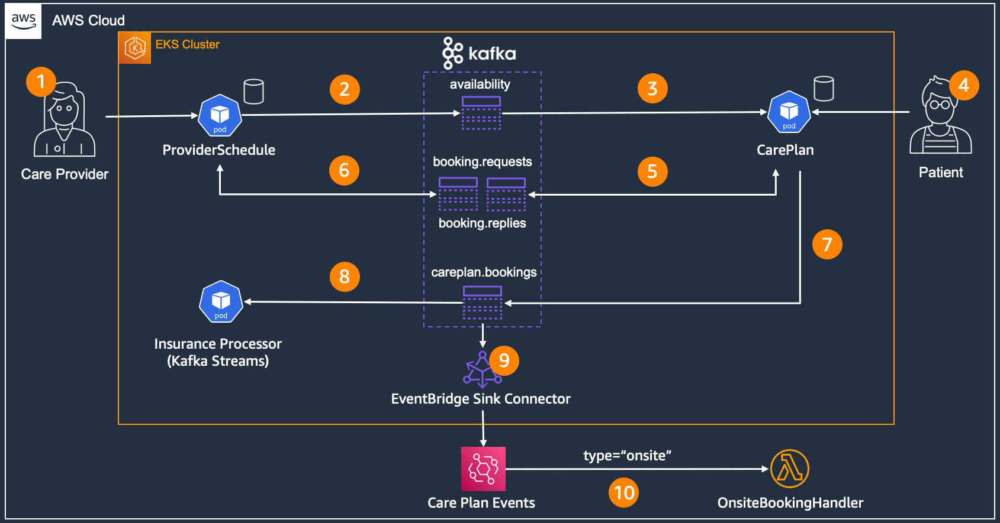
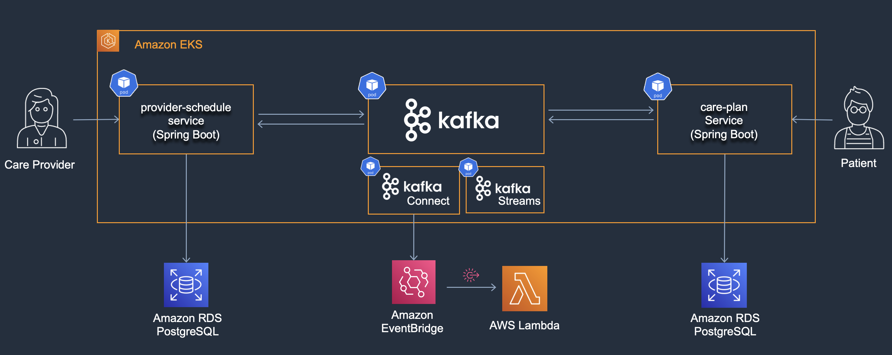

# Event Driven Care Plan on Amazon EKS 

This repository contains a reference architecture for building Event Driven Architectures (EDA) with Open Source technologies such as Kubernetes and Apache Kafka on Amazon Web Services (AWS). The architecture is based on containers, showcases several integration patterns and leverages open source Kafka connectors such as the [Amazon EventBridge Sink connector](https://github.com/awslabs/eventbridge-kafka-connector) to easily integrate with native AWS serverless services.

## Context

The architecture is based on an artificial domain called **Managed Care Plan**. The Managed Care Plan is a platform that allows:

- Care providers to manage their profiles and share their availability
- Patients to create a patient profile and search & book care provider availability (bookings).

## Components

### Provider Schedule Service
An API for **providers** to manage their profiles and availability. The service also offers the possibility for external systems to book the availability via an asynchronous request-reply channel.
### Care Plan Service
An API for **patients** to manage their profiles and to search & book the availabilities that the providers created. 
### Insurance Processor  Service
A Kafka Streams application to filter out bookings that are covered by insurance.
### Clinic Operations via EventBridge and AWS Lambda
A service to handle bookings that are scheduled 'on-site'.

## Application Flow

Below you can find a visualization of the end-to-end application flow and the components involved.

1) Providers can manage their profiles and availability via the Provider Schedule Service. The data will be stored in a PostgreSQL table.
2) The availability will be published as an event to the `provider.availability` topic including provider data (Event Carried State Transfer)
3) The Care Plan service subscribes to the previously mentioned `provider.availability` topic and saves the events in its own database.
4) The Care Plan service allows patients to search through the provider availabilities in an optimized way and to create bookings for those availabilities. The booking data will be stored in a PostgreSQL table.
5) When a booking is created the Care Plan Service sends a command message via the `provider.availability.booking.requests` channel to instruct the Provider Schedule Service to mark this availability as booked. 
6) The Provider Schedule Service processes the booking requests and sends either a confirmation or rejection via the reply channel.
7) Upon successful confirmation (or later cancellation) the Care Plan Service publishes a booking event to the `careplan.bookings` topic
8) The Insurance Processor is a Kafka Streams application that will filter only for bookings that the insurance will cover
9) The EventBridge Kafka Sink Connector forwards all events to Amazon EventBridge for advanced routing capabilities
10) An EventBridge rule is triggered when bookings will be held "on-site" and an AWS Lambda function will do the processing.

# Deployment options

## Option 1: Data on EKS version

This option is based on the streaming blueprint of the [Data on EKS](https://awslabs.github.io/data-on-eks/) project - a tool for building AWS managed and self-managed scalable data platform on [Amazon EKS](https://aws.amazon.com/eks/). The infrastructure will be deployed via Terraform and the application images via Amazon ECR and kubectl.
To deploy the full version with all components to your AWS account please refer to the [deployment instructions](infrastructure/terraform-k8s/README.MD). 

## Option 2: Run locally 

For testing purposes we have provided a local setup to get the application running locally via Docker Compose. This will spin up all the core component without any direct AWS Account interaction. The setup leverages [Localstack](https://github.com/localstack/localstack) to mock out the interaction with Amazon Eventbridge and other Serverless components such as AWS Lambda and SQS are not used in this setup. Please follow the [local setup](infrastructure/local/README.MD) instructions to get started.  

## Security

See [CONTRIBUTING](CONTRIBUTING.md#security-issue-notifications) for more information.

## License

This library is licensed under the MIT-0 License. See the LICENSE file.