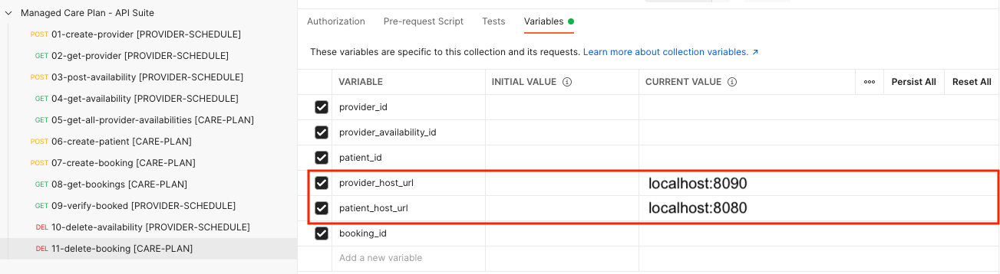
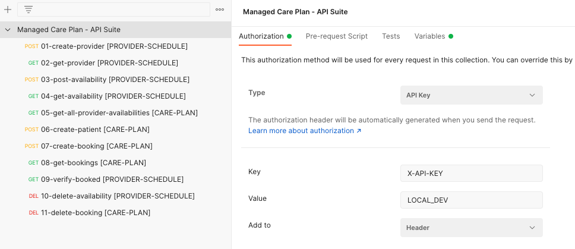

# Run locally

For testing purposes we have provided a local setup to get the application running locally via Docker compose. This will spin up all the core component without any direct AWS Account interaction. The setup leverages [Localstack](https://github.com/localstack/localstack) to mock out the interaction with Amazon Eventbridge.

### 1. Prerequisites

- [Docker](https://www.docker.com/get-started/)

### 2. Run locally

```bash
cd infrastructure/local
docker-compose up --build
```

Hint: If you want to change the source code and rebuild the application you can use:

```bash
docker-compose --remove-orphans -v && docker-compose up --build
```

### 3. Communicate with the API

You can use the included [Postman collection](static/managed_care_plan_api.postman_collection.json) and fill in the ingress url to both host urls:




### Optional: API KEY

In case you want to test the API via curl or any other mechanism you have to provide the Header 'X-API-KEY: LOCAL_DEV' to every request. This has been already configured in the postman collection:




Follow the numbered requests to get an end-to-end view of the application.
