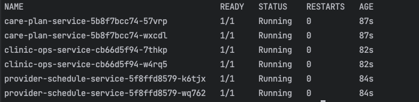
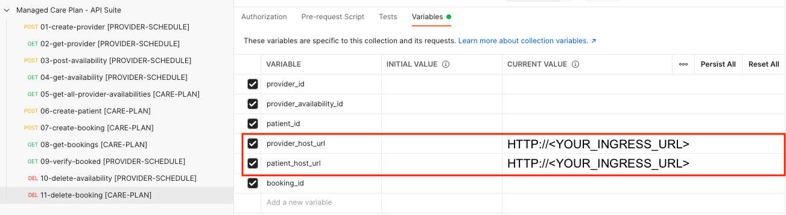
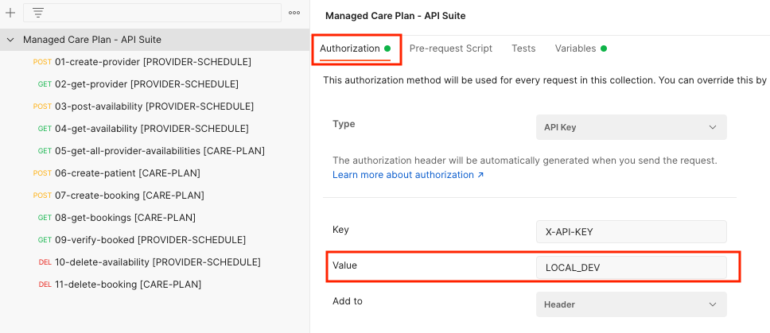

# Deploy to Amazon EKS

In this section you will find the instructions to deploy the reference architecture to you own AWS account. Please keep in mind that this will create charges in your AWS account.

### 1. Prerequisites

- [Terraform](https://developer.hashicorp.com/terraform/tutorials/aws-get-started/install-cli)
- [Docker](https://www.docker.com/get-started/)
- [Amazon ECR Credential Helper](https://github.com/awslabs/amazon-ecr-credential-helper)
- [Kubectl](https://kubernetes.io/docs/tasks/tools/#kubectl)
- [Java 17](https://docs.aws.amazon.com/corretto/latest/corretto-17-ug/what-is-corretto-17.html)

### 2. Setup EKS Cluster, Kafka, Amazon RDS, Secrets and Operators


1. Set designated AWS region:

```bash 
export AWS_REGION=<YOUR_REGION> #For example eu-west-1, us-east-1 etc.
```

2. Deploy the infrastructure:

```bash
cd infrastructure/terraform-k8s
./install.sh
```

Hint: The setup will take around 25-30 Minutes

### 3. Publish application images and deploy to Amazon EKS

1. The following script will build the container images for the application and push them to a private registry:

```bash
cd software
./build-push-images.sh
```
2. Create the needed K8S deployments, services and ingress for the applications.

```bash
./deploy-k8s.sh
```

### 4. Verify deployment and get the load balancer url for testing:

1. Use the following command to verify that the application is running properly:

```bash
kubectl get pods -n app
```


2. Get the load balancer url to be able to communicate with the API

```bash
kubectl get ingress -n app
```
Hint: Might take a few minutes until its ready

### 5. Communicate with the API

You can use the included [Postman collection](static/managed_care_plan_api.postman_collection.json) and fill in the ingress url to both host urls:




### 6. API Authorization

For this example application we are leveraging an API Key (X-API-KEY) that has been created in AWS Secrets Manager during deployment.

Use the following command to get the API Key from Secrets Manager:

```bash
aws secretsmanager get-secret-value --secret-id managed-care-plan-api-key --query "SecretString" --output text | jq -r .apiKey
```

Replace the local API Key with the output from the above command:



Follow the numbered requests to get an end-to-end view of the application.


## Cleanup

If you want to clean up the application please run the following commands:

1. Delete the created Kubernetes resources

```bash
cd software
kubectl delete -f k8s
```

2. Delete the infrastructure components:

```bash
cd infrastructure/terraform-k8s/
./cleanup.sh
```

### Design considerations

To make this solution easily deployable into your own AWS account we have made the following design choices on the infrastructure components that you might want to revise when evolving this solution.

- The sample has chosen smaller instance sizes and scaling targets than recommended for production workloads for both EKS and Kafka to avoid creation of unnecessary cost.
- The sample uses a static API-Key (via Secrets Manager) for authentication on the public endpoints to prevent open access to the application. However, for production workloads please look into securing your endpoints via more sophisticated mechanisms such as [OAuth 2.0](https://aws.amazon.com/blogs/security/access-token-security-for-microservice-apis-on-amazon-eks/) via [Amazon Cognito](https://aws.amazon.com/cognito/).
- The sample leverages Standard HTTP communication with the Load Balancer. Please follow this [guidance](https://repost.aws/knowledge-center/associate-acm-certificate-alb-nlb) to setup a TLS certificate via ACM.
- We use a Single-AZ Amazon RDS deployment without automated backups since the application only stores example data. For production workloads please look into [Amazon RDS Multi-AZ](https://aws.amazon.com/rds/features/multi-az/) and [working with backups](https://docs.aws.amazon.com/AmazonRDS/latest/UserGuide/USER_WorkingWithAutomatedBackups.html).
- Please also take a look into the [AWS Well-Architected Framework](https://docs.aws.amazon.com/wellarchitected/latest/framework/welcome.html) for additional recommendations.

